# 2019CQU IOT读写器实验-TYF于2022/02/23

>#### 系本人基于给定资源原创开发，实现了读写器读写IC卡，实现了读卡号卡类型、实现钱包的创建充值扣款，控制蜂鸣器状态、设置工作模式、查看读写器版本等功能--基于命令行实现
>#### 开发语言：C++
>#### 开发工具：visual studio C++
>#### 读写器：S50

## 项目地址

gitee: [https://gitee.com/TangGarlic/CQU_RFID_2019.git](https://gitee.com/TangGarlic/CQU_RFID_2019.git)

github: [https://github.com/TonyTang-dev/CQU_RFID_2019.git](https://github.com/TonyTang-dev/CQU_RFID_2019.git)

CSDN： [https://editor.csdn.net/md/?articleId=124368436](https://editor.csdn.net/md/?articleId=124368436)

## 注意事项

0. 本人声明原创，非抄袭（万一俺老师以为我自己抄自己的仓库）
1. 拒绝任何形式的恶意篡改和恶意使用
2. 倡导健康绿色的二次开发使用
3. 本人声明，若有基于此代码的恶意行为皆与本人无关

## 实验过程或算法（源程序）

1、实验过程
1.1首先，分析需求，使用S50读写器和一张IC卡，一台计算机和开发工具visual studio C++;
1.2系统要求能够实现查询卡号，初始化钱包以及充值扣款等功能，要求在卡片接触时有蜂鸣器呼叫；
1.3综合上述要求：系统要能够实现查询功能，读写功能和控制蜂鸣器的功能，并在此基础上进行延伸；
1.4首先实现卡号查询功能，由于需要使用串口对象的地方较多，因此我将串口实例声明为指针，便于传参使用。读卡时，我们首先要向读写器写入命令，如读卡命令格式如下：

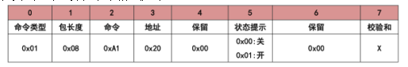

其为8字节的数据，因此我们在全局声明一个字节数组用来存储命令，以便于发送到读写器，通过CheckSumOut()函数来计算命令的校验和并写入到命令中，通过SerialPort->WriteData()函数将命令写入读写器中，再通过SerialPort->GetBytesInCOM()函数获取端口输入，在得到串行数据之后将其存入一个临时数组中，并检验返回数据的类型，如果返回数据成功则计算其校验和以检验数据正确性，通过Hex2Str()函数将字节流转化为字符流，通过对数据的解析获得卡数据和卡类型并显示到控制台上。最终查询卡号效果如下图：

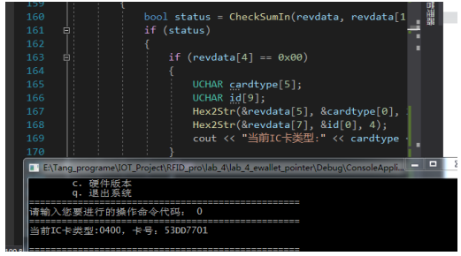

1.5由于实验需要对IC卡的各个块号进行读写，所以先引入对数据块的操作，而后再进行“钱包”的创建操作；对数据块的操作方式与读卡号相类似，根据命令手册初始化对应的命令存入对应的命令格式中，计算校验和之后，将命令通过串口实例发送到下位机中，并获取返回的串口数据，解析得到对应的数据；写入数据与此同理。
1.6钱包操作：首先初始化钱包，这里我默认钱包的存储块号是8号，不提供用户自定义修改的接口，同时初始化钱包时，将钱包余额初始化为0；选取对应的命令发送给下位机；钱包充值：命令发送与上述同理，需要注意的是，钱包的余额存储方式为6-9字节以“低-高”的方式进行存储，而当前系统只提供用户十进制输入的类型，显然与用户输入的存储方式不一致，所以我对数据的处理是，充值数据以8字节存储，输入不满8字节时，在前方自动补0，这样就能很好的实现数据的写入和操作，实现算法如下：

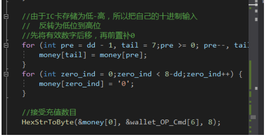

1.7钱包扣款的实现与充值类似
1.8查询余额即发送对应命令，解析返回数据即可
1.9至此，钱包的操作实现完毕，将各类提示封装，提高用户可操作性。
1.10在此基础上，向系统添加了蜂鸣器状态控制、卡片检测、读写器工作模式设置，强制蜂鸣器蜂鸣和查看读写器版本以及关闭系统的功能；
1.11蜂鸣器状态控制：控制的主要是0x04类命令的状态，当设置为关闭时执行此类命令时蜂鸣器不会响起，反之则会蜂鸣，用户可通过选择功能并输入对应命令控制其状态；
1.12卡片检测：卡片检测是一直等待卡片进入读写器，如果读写器上没有卡片则不会有任何输出，反之则会输入卡片的类型和卡号，目前仅读一次，即卡片放到读写器上会读取一次便不会再读取，同时进过3秒延时之后会自动跳出监听状态进入主系统；
1.13读写器工作模式设置：当前仅实现了自动读卡号模式，当发送命令时，会将读写器的工作模式设置为自动读卡号，即当有卡片接触读写器，蜂鸣器会提示同时会返回卡片数据，由于其他模式的设置与此类似，故此系统暂时未实现其他命令；
1.14强制蜂鸣器蜂鸣：通过强制命令控制蜂鸣器长响和关闭其长响；
1.15查看读写器版本，通过发出对应命令，接受串口数据并解析得到读写器的版本号并显示到控制台上。
1.16最后，通过监听用户输入，当用户输入关闭命令时，通过系统函数exit()退出系统。
1.17至此，整个实验完毕，但系统还可继续扩展，首先与实验时间，本实验暂时到此。
系统主页效果：

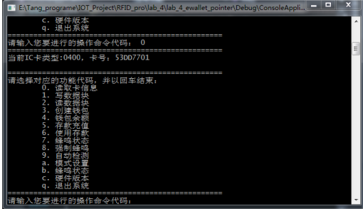


1、源程序实现（主要部分）
由于源代码太长，这里展示读卡号源代码，其余部分见附录一
```cpp
1 /// <summary>
2 /// 读卡号函数封装
3 /// </summary>
4 /// <param name="argc">串口对象：*mySerialPort</param>
5 /// <param name="argv"></param>
6 /// <returns>none</returns>
7 
8 void readIC(SerialPort *mySerialPort) {
9 	UCHAR inbyte;
10	UCHAR revdata[32];
11	UINT len = 0;
12	UINT readbytes;
13	CheckSumOut(CmdReadId, CmdReadId[1]);
14	mySerialPort->WriteData(CmdReadId, CmdReadId[1]);
15	Sleep(200);								// 延时200毫秒等待读写器返回数据，延时太小可能无法接收完整的数据包
16	len = mySerialPort->GetBytesInCOM();	//获取串口缓冲区中字节数
17	if (len >= 8)							// 读卡号读卡器返回的数据包长度：失败为8字节，成功为12字节
18	{
19		readbytes = 0;
20		do									// 获取串口缓冲区数据
21		{
22			inbyte = 0;
23			if (mySerialPort->ReadChar(inbyte) == true)
24			{
25				revdata[readbytes] = inbyte;
26				readbytes++;
27			}
28		} while (--len);
29		if ((revdata[0] = 0x01) && ((revdata[1] == 8) || (revdata[1] == 12)) && (revdata[1] == readbytes) && (revdata[2] == 0x0A1) && (revdata[3] = 0x20))
30		{
31			bool status = CheckSumIn(revdata, revdata[1]);
32			if (status)
33			{
34				if (revdata[4] == 0x00)
35				{
36					UCHAR cardtype[5];						//保存卡类型
37					UCHAR id[9];							//保存卡号
38					Hex2Str(&revdata[5], &cardtype[0], 2);	// 数组revdata[5]开始2字节为卡类型
39					Hex2Str(&revdata[7], &id[0], 4);		// 数组revdata[7]开始4字节为卡号
40					cout << "当前IC卡类型:" << cardtype << "，卡号：" << id << endl;
41				}
42				else
43				{
44					cout << "未检测到卡，将IC放置到读写器感情区才可读卡！" << endl;
45				}
46			}
47		}
48	}
49	else
50	{
51		cout << "读卡超时，请检查读卡器的连接是否正常！" << endl;
52		while (len > 0)
53		{
54			mySerialPort->ReadChar(inbyte);
55		}
56	}
57
58	return;
59}
```

## 实验结果及分析和（或）源程序调试过程
1、实验结果
1.1 实验功能完全实现，读写器接触卡则蜂鸣器响起，能够卡数据，初始化钱包和充值扣款功能得到完全实现并能正常工作，在此基础上实现了读写块数据，控制蜂鸣器，设置读写器工作状态和查看读写器版本等功能；
1.2 实现效果图
1.2.0 测试软件运行图

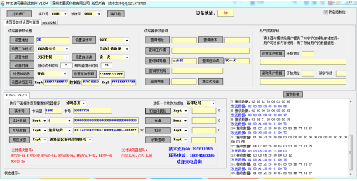

1.2.1 系统主页

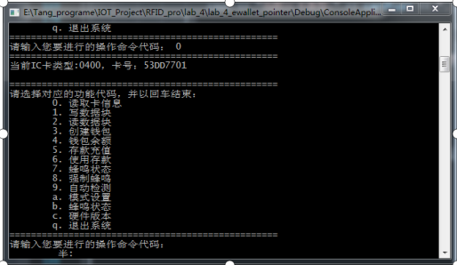

1.2.2 启动系统监听卡片效果

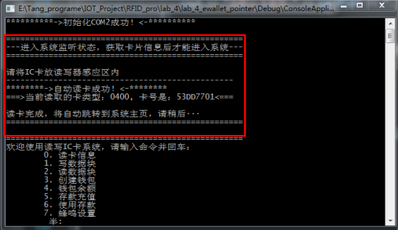

1.2.3 初始化钱包，充值扣款效果图

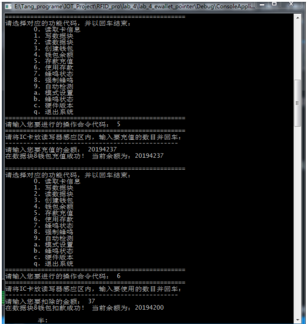

1.2.4 自动检测效果

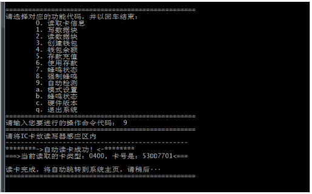

1.2.5 设置工作模式和设置蜂鸣模式和查看读写器版本效果

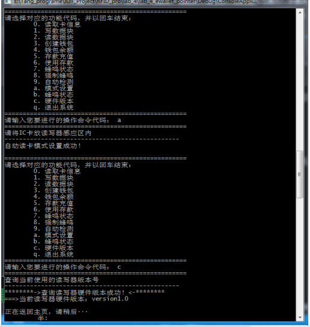

1.2.6 退出系统

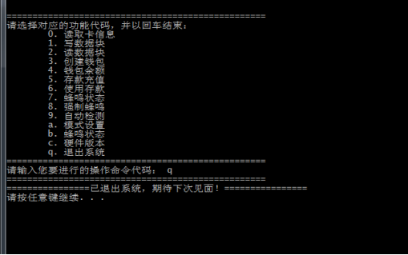

1.2.7 实物图

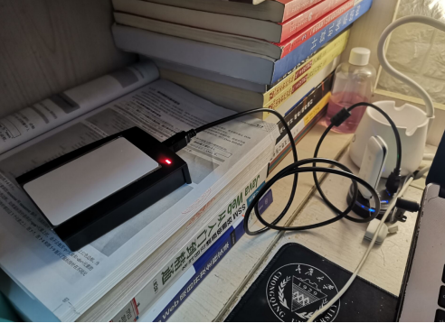


2、调试过程及所遇问题
2.1 问题
2.1.1 在读写块数据和获取充值金额时，总是出现数据解析错误，从而导致系统出现错误
原因分析：系统在获取输入时由于存在结尾字符，自动将字符串末尾填充NULL，导致解析错误，因此需要对输入数据遍历，并设置为初始值；
问题解决：对输入数据遍历，对控制符再初始化为初始值，因为此值是未使用的，更改不会对系统造成影响，问题得到解决。

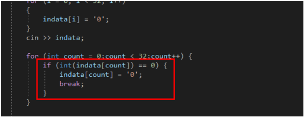

2.1.2 在钱包的充值和扣款中，出现金额增减出错的问题
原因分析：IC卡存储金额的方式为“低-高”位的存储方式，如果不对用户输入进行格式化，则会出错，导致错误解析；
问题解决：对用户输入进行格式化，对输入的数据按照8字节的宽度使用前置补0，使其工作正常。

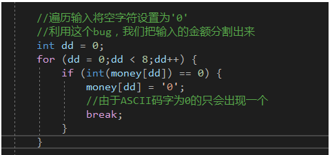


3、调试过程
3.1.1 调试中，大部分的代码重复率高，导致出现大量冗余，因此后期将可复用代码封装为函数，增强系统底层代码的可复用性。
3.1.2 由于大部分命令具有可复用性，即大部分命令的长度和格式都相类似，因此特地声明全局的命令格式数组，可在不同阶段，根据需求修改命令格式，进而实现相应效果，如下：

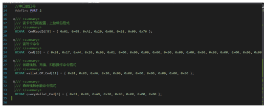


至此，实验完成